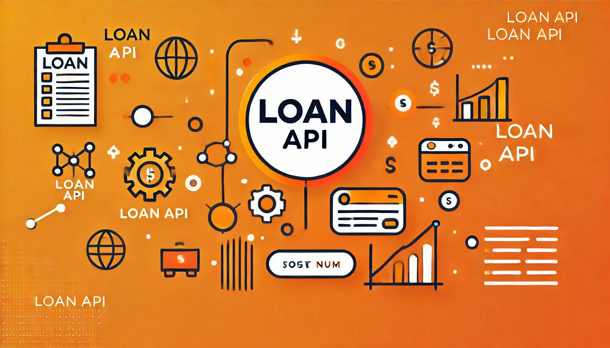

# <p align="center">API de Prédiction d'éligibilité à un Prêt</p>

<p align="center">
    
</p>

## ➔ Menu

* [➔ Structure du Projet](#-structure-du-projet)
* [➔ Comment Exécuter](#-comment-exécuter)
* [➔ Prérequis](#-prérequis)
* [➔ Sorties](#-sorties)
* [➔ Critères d'évaluation](#-critères-dévaluation)
* [➔ Métriques de Performance](#-métriques-de-performance)
* [➔ Licence](#-licence)
* [➔ Auteurs](#-auteurs)

---

## Structure du Projet

Ce projet inclut les fichiers et modules principaux suivants :

- **app/**
    - **main.py** : Point d'entrée de l'API. Initialise et exécute l'application FastAPI.
    - **routes/** :
        - **auth.py** : Définit les endpoints d'authentification (connexion, activation).
        - **loans.py** : Endpoints pour les prédictions de prêts et l'historique des prêts.
        - **admin.py** : Endpoints spécifiques aux administrateurs pour la gestion des utilisateurs.
    - **models/** :
        - **loan_model.pkl** : Fichier sérialisé du modèle de machine learning.
        - **user.py** : Classe SQLModel définissant la structure de la table User.
        - **loan.py** : Classe SQLModel définissant la structure de la table LoanRequest.
    - **core/** :
        - **security.py** : Fonctions utilitaires pour l'authentification, le hachage des mots de passe et les JWT.
        - **ml_model.py** : Contient le modèle de machine learning pour la prédiction d'éligibilité aux prêts.
        - **config.py** : Paramètres de configuration de l'application.
    - **database/** :
        - **database.py** : Connexion à la base de données et gestion des sessions avec SQLModel.
    - **schemas/** :
        - **loans.py** : Modèles Pydantic pour la validation des données de prêts.
        - **users.py** : Modèles Pydantic pour la validation des données utilisateur.
    - **migration_az.py** : Permet la migration des informations dans la database azur. La modification des tables pour convenir au langage mssql ont été réalisées directement par des requêtes sur le portail azur.
    
---

## Comment Exécuter

Suivez ces étapes pour exécuter le projet :

1. Assurez-vous que Python >= 3.9 est installé sur votre système.
2. Clonez ce dépôt sur votre machine locale :

```bash
    git clone https://github.com/username/loan-prediction-api.git
```
3. Accédez au répertoire du projet :

```bash
    cd loan-prediction-api
```
4. Installez les dépendances requises :

```bash
    pip install -r requirements.txt
```
5. Appliquez les migrations de la base de données avec Alembic :

```bash
    alembic upgrade head
```
6. Exécutez l'application FastAPI :

```bash
    uvicorn app.main:app --reload
```

---

## Prérequis

Liste des logiciels et bibliothèques requis :

- Python >= 3.9
- FastAPI
- SQLModel (basé sur SQLAlchemy et Pydantic)
- Uvicorn
- Passlib (hachage de mots de passe)
- Python-jose (JWT)
- pandas
- scikit-learn (pour le modèle de ML)

---

## Sorties

L'API fournit les résultats suivants :

- Réponses JSON indiquant l'éligibilité à un prêt.
- Enregistrements historiques des demandes de prêts.
- Réponses pour la gestion des utilisateurs par l'administrateur.

### Exemple de Sortie

<p align="center">Lien ➔ <a href="http://ussbaapi.francecentral.azurecontainer.io:8000/docs">http://ussbaapi.francecentral.azurecontainer.io:8080/docs</a>
</p>
<p align="center"><i>Ce lien est réservé à un usage interne.</i></p>


**Prédiction d'éligibilité à un prêt**

```json
{
    "eligible": true,
    "status": "approved",
    "loan_request_id": 1
}
```

---

## Critères d'évaluation

### Modalités éducatives
- Groupe de 3 personnes
- Durée : 2 semaines

### Modalités d'évaluation
- Présentation orale
- Revue de code par les pairs

### Livrables
- Lien vers le dépôt GitHub de l'API
- Lien vers le dépôt GitHub du projet Django

---

## Métriques de Performance

- L'application et l'API respectent les exigences du cahier des charges.
- Aucune faille de sécurité évidente.

---

## Licence

[Licence MIT](LICENSE)

---

## Auteurs

- **Khadija Aassi**
  <a href="https://github.com/khadijaaassi" target="_blank">
      
  </a>

- **Ludivine Raby**
  <a href="https://github.com/ludivineRB" target="_blank">
      
  </a>

- **Raouf Addeche**
  <a href="https://github.com/RaoufAddeche" target="_blank">
      
  </a>

---

